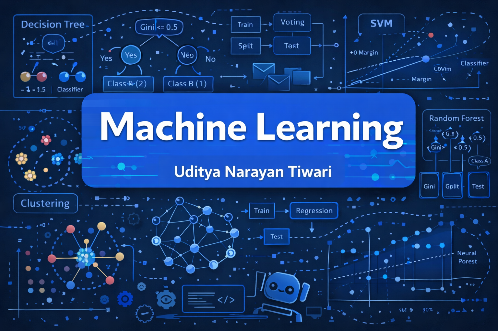
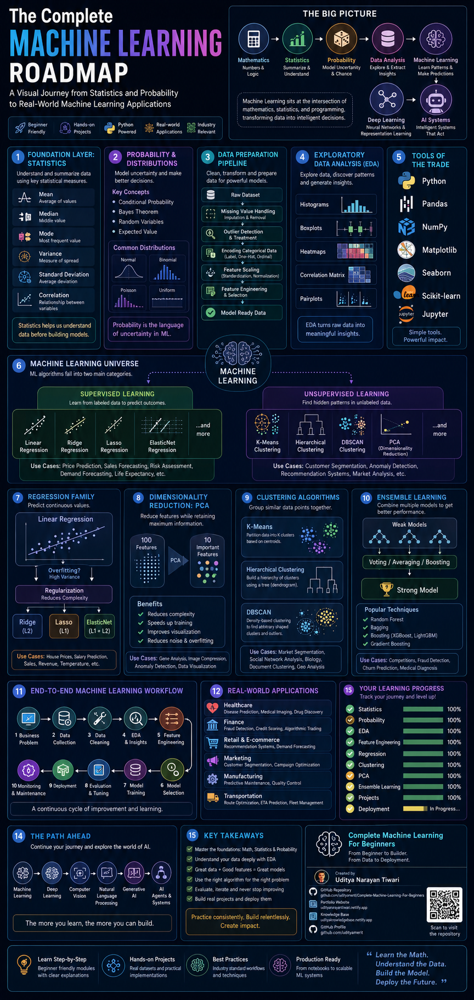

<h1 align="center">🧠 Complete Machine Learning Roadmap For Beginners </h1>
<p align="center">



  A comprehensive, step-by-step learning repository covering the complete journey from statistics to machine learning model deployment using Python.
</p>
<p align="center">
  <a href="https://github.com/udityamerit"></a>
  <a href="https://www.linkedin.com/in/uditya-narayan-tiwari-562332289/"></a>
  <a href="https://udityanarayantiwari.netlify.app/"></a>
</p>

---

## 📘 Overview

This repository is structured as a **complete ML roadmap** combining theory (PDFs) with hands-on coding (Jupyter Notebooks) to help you build a solid foundation in data science and machine learning. Ideal for students, self-learners, and professionals looking to revise or upgrade.

---


---

## 🔍 Key Features

- ✅ Beginner to Intermediate level ML roadmap
- 📚 Theory + Jupyter-based code implementation
- 📊 Real-world datasets used
- 🧠 Covers statistical reasoning behind ML
- 🚀 Final projects for practical application

---

## 💻 Installation

To run the notebooks locally:

```bash
git clone https://github.com/udityamerit/Complete-Machine-Learning-For-Beginners.git
cd complete-ml-roadmap
pip install -r requirements.txt
````

---

## 📦 Dependencies

The major libraries used:

* `numpy`
* `pandas`
* `matplotlib`
* `seaborn`
* `scikit-learn`
* `statsmodels`

All dependencies can be installed via:

```bash
pip install -r requirements.txt
```

---

## 📁 Notable Notebooks

### 📌 Feature Engineering

* `5.1-Handling_missing_values.ipynb`
* `5.2-Handling_Imbalance_dataset.ipynb`
* `5.3-Handling_outliers_and_Data_Encoding.ipynb`

### 📌 Exploratory Data Analysis

* `6.1-EDA_On_Wine_Dataset.ipynb`
* `6.2-EDA_On_Flight_Price_Prediction.ipynb`
* `6.3-EDA+And+FE+Google+Playstore.ipynb`

### 📌 Regression Models

* `8.1-Complete_Simple_Linear_Regression.ipynb`
* `8.2-Multiple_Linear_Regression.ipynb`
* `8.3-Polynomial_Regression.ipynb`
* `9.1-Ridge_Lasso_Regression.ipynb`

### 📌 Mini Projects

* `10.1-Basic_Simple_Linear_Regression_Project.ipynb`
* `10.2-Multiple_Linear_Regression_Project.ipynb`

---

## 👨‍💻 Author

**Uditya Narayan Tiwari**
🎓 B.Tech in CSE (AI & ML) @ VIT Bhopal University

🔗 [Portfolio Website](https://udityanarayantiwari.netlify.app/)

📂 [GitHub Profile](https://github.com/udityamerit)

💼 [LinkedIn](https://www.linkedin.com/in/uditya-narayan-tiwari-562332289/)

---

## 📄 License

This repository is licensed under the [MIT License](./LICENSE).

